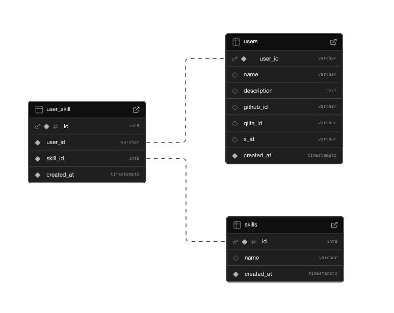

<h1 align="center">名刺アプリ</h2>

<p align="center">
  </a>&nbsp 
  </a>&nbsp 
  </a>&nbsp 
  </a>&nbsp 
  </a>&nbsp 
  </a>&nbsp 
  </a>&nbsp 
</p>

ユーザー情報とスキルを管理するシンプルな名刺アプリです。
React + TypeScript + Supabase で構築されています。


## 機能

- ユーザー名刺の登録・表示・編集
- ユーザースキルの管理
- SNS 情報の連携（GitHub, Qiita, X）
- 自動データクリーンアップ（前日登録したユーザーデータ）

## 技術スタック

| カテゴリ           | 技術            | 説明                        |
| ------------------ | --------------- | --------------------------- |
| **フロントエンド** | React 19        | UI ライブラリ               |
|                    | TypeScript      | 型付き JavaScript           |
|                    | Chakra UI       | UI コンポーネントライブラリ |
|                    | React Router    | ルーティングライブラリ      |
|                    | React Hook Form | フォーム状態管理            |
| **バックエンド**   | Supabase        | BaaS プラットフォーム       |
|                    | PostgreSQL      | リレーショナルデータベース  |
| **テスト**         | Jest            | テストフレームワーク        |
|                    | Testing Library | UI テストライブラリ         |
| **CI/CD**          | GitHub Actions  | 自動化ワークフロー          |
| **その他**         | DOMPurify       | XSS 対策                    |

## データベース構成



### テーブル構造

| テーブル名     | 説明                           | 主なカラム                                                            |
| -------------- | ------------------------------ | --------------------------------------------------------------------- |
| **users**      | ユーザー基本情報               | user_id(PK), name, description, github_id, qiita_id, x_id, created_at |
| **skills**     | スキルマスタ                   | id(PK), name                                                          |
| **user_skill** | ユーザーとスキルの中間テーブル | id(PK), user_id(FK), skill_id(FK)                                     |

### データベース構築方法

1. Supabase プロジェクトを作成する

2. `supabase/schema_dump.sql`を使用してデータベーステーブルを構築する

**skills テーブルには、少なくとも１つ以上データを登録すること**

## セットアップ

### 必要条件

- Node.js (バージョン 20)
- npm または yarn
- Supabase アカウント

### インストール

1. リポジトリをクローンする

```bash
git clone https://github.com/yourusername/ts-card-app.git
cd ts-card-app
```

2. 依存関係をインストールする

```bash
npm install
```

3. 環境変数を設定する

`.env` ファイルを作成し、以下の内容を設定します：

```
VITE_SUPABASE_URL=your-supabase-url
VITE_SUPABASE_ANON_KEY=your-supabase-anon-key
```

> `.env` ファイルは `.gitignore` に追加して、実際のキーや URL が公開リポジトリにコミットされないようにしてください。

4. 開発サーバーを起動する

```bash
npm run dev
```

## 使用方法

### 名刺の閲覧

1. ホーム画面で名刺 ID を入力
2. 「名刺を見る」ボタンをクリック

### 名刺の登録

1. ホーム画面で「新規登録」をクリック
2. 必要情報を入力（英単語 ID、名前、自己紹介、スキル）
3. オプションで SNS アカウントを入力
4. 「登録」ボタンをクリック

### 名刺の編集

1. 名刺表示画面で「編集」ボタンをクリック
2. 情報を編集
3. 「更新」ボタンをクリック

## プロジェクト構造

```
ts-card-app/
├── .github/
│   └── workflows/      # GitHub Actions設定
├── batch/              # バッチ処理スクリプト
├── public/             # 静的ファイル
├── src/
│   ├── __tests__/      # テストファイル
│   ├── components/     # Reactコンポーネント
│   ├── domain/         # ドメインモデル・型定義
│   ├── lib/            # ビジネスロジック
│   ├── utils/          # ユーティリティ関数
│   └── validations/    # バリデーションスキーマ
└── assets/
│   └── images/         # 画像ファイル
└── supabase/           # DBbackup
```

## テスト

テストを実行するには以下を実行する。

```bash
npm run test
```

## バッチ処理

前日登録したユーザーデータを、毎日 AM6:00 に自動的に削除するバッチ処理があります。

手動でバッチを実行するには以下を実行してください。

```bash
npx tsx ./batch/index.ts
```
